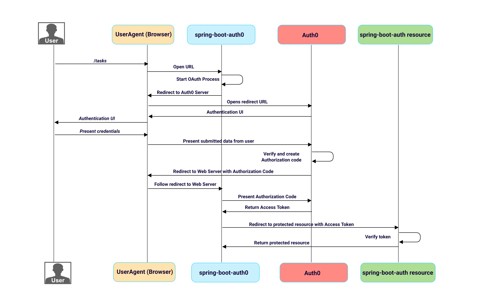
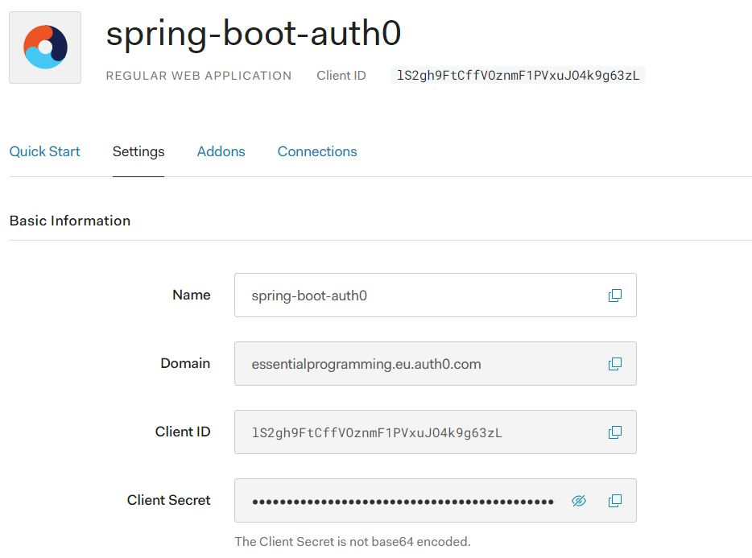
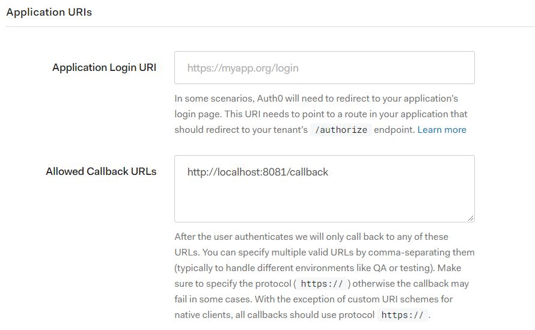
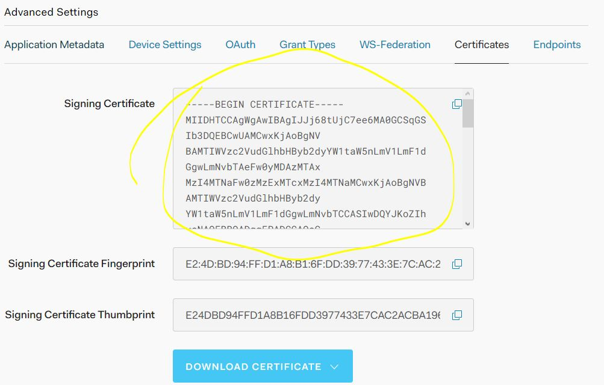
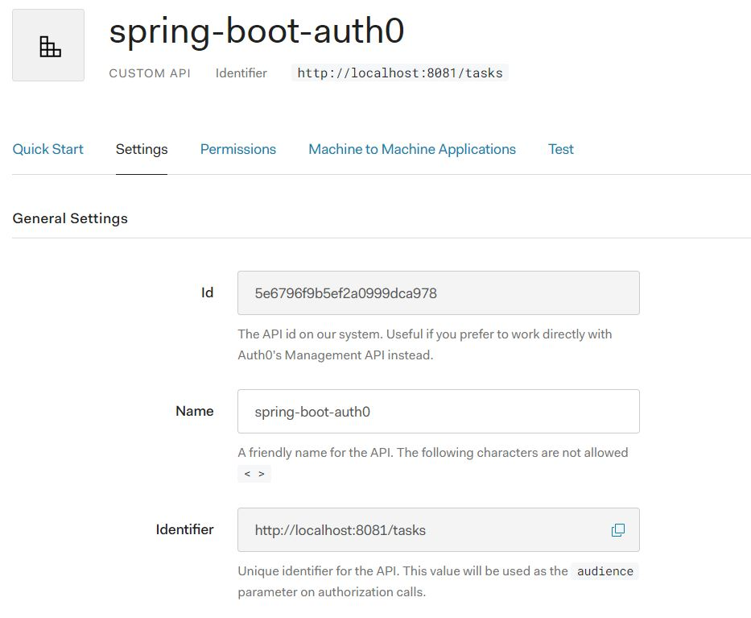

# Spring Boot Auth0 application

Spring Boot Auth0 sample application is designed to incorporate a Resource Server and an integrated Auth0 authorization and authentication in one application.

## Overview

The authorization flow is implemented by following the OAuth 2.0 specification through the Auth0 identity platform. The client uses the authorization code grant to get the access token in order to access the resource server's API. 
More about OAuth2 specification and flows [here](https://github.com/digital-consulting/oauth2)

  

## Spring Boot Auth0's security

The server's endpoints are protected from external request and are only accessible with a valid JWT token emitted by the Auth0 platform.
The verification process consists in a filter chain containing the following two filters:
* **Cookie verification filter**: for every incoming request for the protected resources Cookie is verified first. If it exists and it contains a valid JWT token, authorization is successful, otherwise the filter chain jumps to the following filter: 
* **JWT token verification filter**: if no successful Cookie authorization happened before the token verification filter checks if a valid JWT token is present as URL parameter. The filter chain jumps to the following filter:
* **Auth0AuthorizationFilter**: in function of the result of the JWT token validation Auth0AuthorizationFilter forwards to the resource server's API or to the Auth0 user authentication page.
 
## Auth0

1. Create and account and an application in the Auth0 platform. Add the client id and the client secret to the client application (spring-boot-auth0)
  
1. Allow your client's callback URL in case of successful Auth0 authorization
  
1. Copy the signing certificate from the application's advanced setting to your client app (oauth0_key.pem in spring-boot-auth0)
  
1. Create an API for you resource server in the Auth0 app
  
   

## How to test/run:

1. Start the application via IDE, running SpringBootAuth0Application.main, or by command line: java -jar build/libs/spring-boot-auth0-0.0.1-SNAPSHOT.jar;
1. Access the secured endpoint via: http://localhost:8081/tasks;
1. The /tasks endpoint is secured with Auth0 authentication, so the user has to authenticate before being able to access the protected endpoint;
1. In case of successful authentication the server provides a JWT token and will redirect to the /tasks endpoint with the token as request parameter;
1. In case of valid JWT token the server will respond with a JSON response and add a cookie with the included token, otherwise will redirect to Auth0 authentication;
1. For further requests (for ex: refresh page) the token from the cookie will be verified first.

